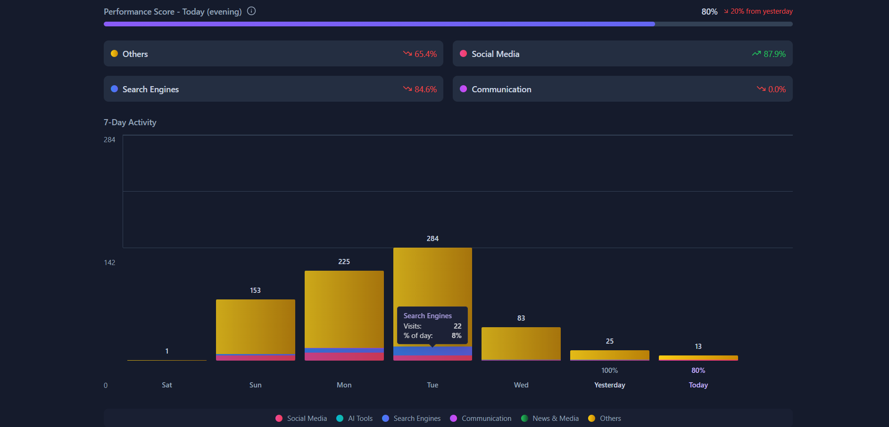

# 🧠 Browser Buddy – Screen Time Tracker ⏳

A privacy-first Chrome Extension that visualizes your browser usage like your phone's screen time report. Get insights into how much time you spend on different websites throughout the day and week—helping you build better digital habits and stay productive online.





---

## 🚀 Features

- 📊 **Daily Usage Summary**  
  View total screen time for today.

- 📅 **Weekly Usage Bar Chart**  
  A visual breakdown of your daily usage for the current week.

- 🌐 **Top Visited Sites**  
  Know which sites consumed most of your time.

- 🧠 **Categorization**  
  Automatically groups websites into categories: Social Media, Work, Entertainment, etc.

- 🔍 **Real History Data**  
  Uses Chrome's history API to fetch actual usage—no fake/mock data.

- 🕶️ **Modern UI**  
  Clean layout inspired by mobile screen-time dashboards.

- 🔐 **Privacy-Focused**  
  All data is processed locally. Nothing is sent or stored externally.

---

## 🛠️ Installation (Local Development)

1. **Clone the Repository**

   ```bash
   git https://github.com/snikdhendu/Browser-Buddy.git
 

2.  **Install Dependencies**
   ```bash
   npm install
   ```

3.  **Build the Extension**
-This step will generate the dist/ folder needed to load into Chrome.

  ```bash
   npm run build
```

### 4. 🧩 **Load the Extension in Chrome**

- Open Chrome and go to: `chrome://extensions`
- Enable **Developer Mode** using the toggle in the top-right corner.
- Click on **Load Unpacked**.
- Select the `dist/` folder generated from the previous step.

✅ Done! You should now see **Browser Buddy** active in your Chrome Extension bar.

## ⭐️ **Show Some Love**

Made with 💻 by [**Snikdhendu**](https://github.com/Snikdhendu)

If you find this project helpful, **give it a ⭐️ on GitHub** and share it with your friends!


